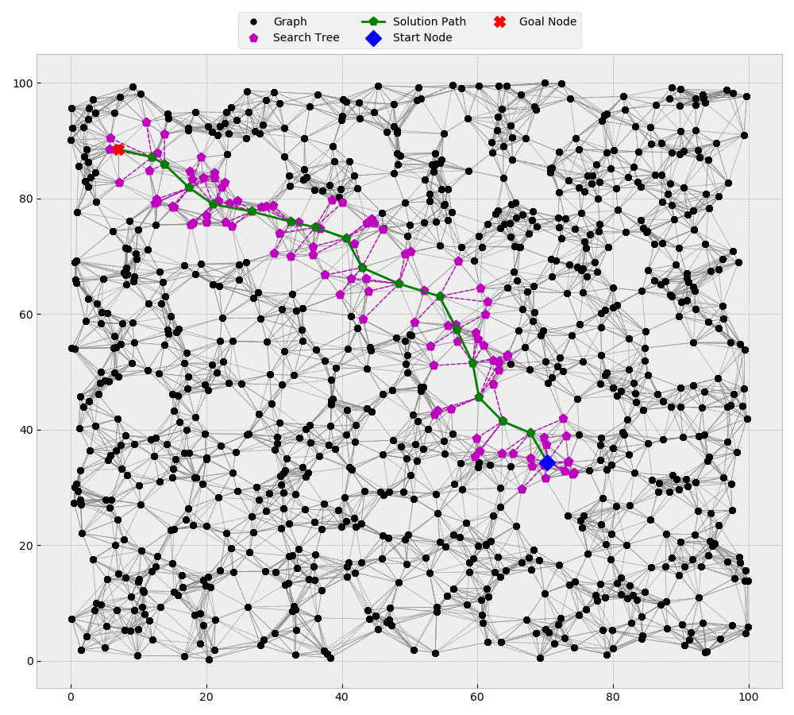

# cpp_robotics

## Overview
This is a C++ repository containing various robotics related algorithms implemented in C++17.  
I try my best to follow the clang-tidy guidelines. I believe that open-sourced codes are meant to be read more than
they are meant to be coded. Hence I try to make an optimal use of the latest C++17 features, the STL libraries, 
and other open-sourced libraries that simplify the code.

**Note:** Codes for visualizing the algorithms are written in Python 3.7.  
**Note:** Some codes for synthetic data generation are written in Python 3.7.  

## Table of Contents
### Algorithms
- [dijkstra](./dijkstra): Graph based implementation of Dijkstra algorithm.
- [a-star](./a-star): Graph based implementation of A* algorithm.
- [weighted_a-star](./weighted_a-star): Graph based implementation of Weighted A* algorithm.
- [ara-star](./): Coming Soon. # TODO
- [ana-star](./): Coming Soon. # TODO
- [rrt_2d](./rrt_2d): Graph based implementation of RRT algorithm in 2D workspace.
- [kalman_filter](./kalman_filter): Linear algebra based implementation of basic 2D Kalman filter.
- other algorithms coming soon...

### Supporting / Utility Packages
- [graph_sandbox](./graph_sandbox): Some random examples demonstrating graph creation using boost graph library.
- [random_data](./random_data): Some functions for efficient random data generation in the project.
- [synthetic_data](./synthetic_data): Some functions for efficient synthetic data generation in the project.

### Visualizations

<div class="table-wrapper">
<table class="alt">
  <tr>
    <td> 
        <a href="./dijkstra"><b>Dijkstra Algorithm</b></a>  
        <div><span class="image fit"></span></div>
    </td>
    <td> 
        <a href="./a-star"><b>A* Algorithm</b></a>  
        <div><span class="image fit"></span></div>
    </td>
    <td> 
        <a href="./weighted_a-star"><b>Weighted A* Algorithm</b></a>  
        <div><span class="image fit"></span></div>
    </td>
  </tr>
</table>
</div>

<div class="table-wrapper">
<table class="alt">
  <tr>
    <td> 
        <a href="./ara-star"><b>ARA* Algorithm</b></a>  
        <div><span class="image fit"></span></div>
    </td>
    <td> 
        <a href="./ana-star"><b>ANA* Algorithm</b></a>  
        <div><span class="image fit"></span></div>
    </td>
  </tr>
</table>
</div>

<div class="table-wrapper">
<table class="alt">
  <tr>
    <td> 
        <a href="./rrt_2d"><b>RRT Algorithm</b></a>  
        <div><span class="image fit"></span></div>
    </td>
    <td> 
        <a href="./rrt_2d_motion"><b>RRT Algorithm (with motion model)</b></a>  
        <div><span class="image fit"></span></div>
    </td>
  </tr>
</table>
</div>

### Run Instructions
Each directory in the main project directory [cpp_robotics](./) contains a sub-project with its own CMakeLists.txt
file.  
The general process to run any project is following.  
**For Ubuntu:**  
```shell script
# open the sub-project directory
cd ./<sub-project>

# view the CMakeLists.txt file of the sub-project
cat ./CMakeLists.txt

# make sure proper directories are included in the CMakeLists.txt file.
<use code editor of your preference to edit CMakeLists.txt>

# create a build directory
mkdir build

# open the build directory
cd build

# cmake the project in the build directory
cmake .. 

# make the cmake project
make -j4

# execute the generated executible file
./<executible file>
```
**For Windows:** I would recommend using an IDE that uses CMake for build process. Use the contents of the provided
CMakeLists_Windows.txt file in the CMakeLists.txt file of your project generated by the IDE.
Example IDE: CLion by Jetbrains, Visual Studio etc.