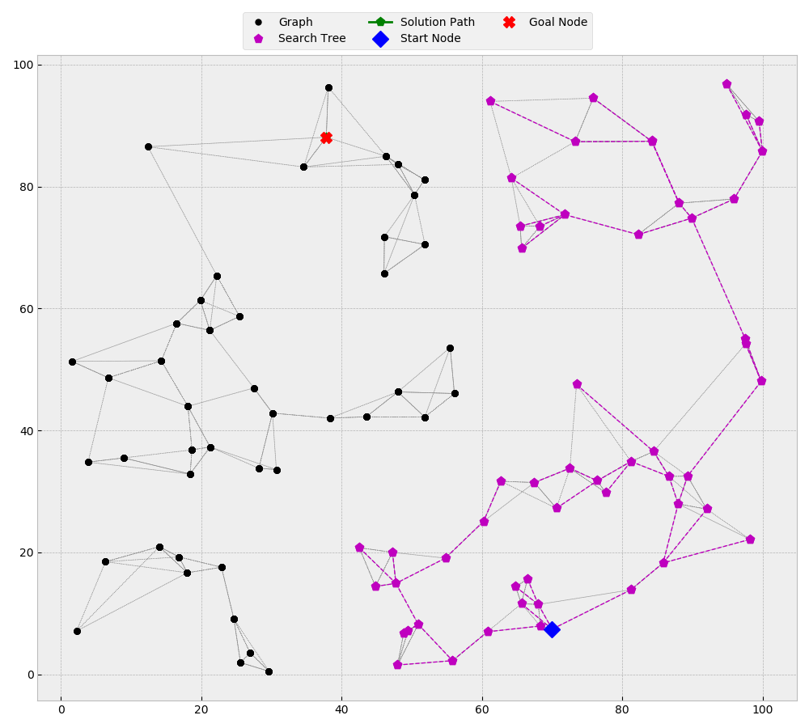

```shell script
./cmake-build-release/a_star -s 9 -g 5 -n ./inputs/nodes_1.txt -e ./inputs/edges_with_costs_1.txt -p ./outputs/path_output_1.txt -t ./outputs/search_output_1.txt -v
start_id: 9, goal_id: 5, weight: 1, verbose: 1
node_fp: ./inputs/nodes_1.txt
edge_fp: ./inputs/edges_with_costs_1.txt
path_fp: ./outputs/path_output_1.txt
search_fp: ./outputs/search_output_1.txt

Successfully opened the nodes file: ./inputs/nodes_1.txt
The nodes files has 10 nodes.
10 nodes were added to the graph.

Successfully opened the edges file: ./inputs/edges_with_costs_1.txt
The edges file has 80 edges.
46 unique edges were added to the graph.

The search was successful. It took 1 microseconds.
Start Node: node_id: 9, x: 98.7975, y: 14.8877, p_node_id: 0, status: closed, g_cost: 0, h_cost: 89.0021, f_cost: 89.0021
Goal Node: node_id: 5, x: 48.4548, y: 88.2838, p_node_id: 4, status: closed, g_cost: 103.676, h_cost: 0, f_cost: 103.676

Successfully opened the path file: ./outputs/path_output_1.txt
Successfully wrote path file: "./outputs/path_output_1.txt".

Successfully opened the graph file: ./outputs/search_output_1.txt
Successfully wrote graph file: "./outputs/search_output_1.txt".
```
This search was then visualized using [search_viz.py](./support_files/search_viz.py)  


```shell script
./cmake-build-release/a_star -s 88 -g 9 -n ./inputs/nodes_2.txt -e ./inputs/edges_with_costs_2.txt -p ./outputs/path_output_2.txt -t ./outputs/search_output_2.txt -v
start_id: 88, goal_id: 9, weight: 1, verbose: 1
node_fp: ./inputs/nodes_2.txt
edge_fp: ./inputs/edges_with_costs_2.txt
path_fp: ./outputs/path_output_2.txt
search_fp: ./outputs/search_output_2.txt

Successfully opened the nodes file: ./inputs/nodes_2.txt
The nodes files has 100 nodes.
100 nodes were added to the graph.

Successfully opened the edges file: ./inputs/edges_with_costs_2.txt
The edges file has 800 edges.
512 unique edges were added to the graph.

The search was successful. It took 10 microseconds.
Start Node: node_id: 88, x: 96.6053, y: 11.9207, p_node_id: 0, status: closed, g_cost: 0, h_cost: 107.392, f_cost: 107.392
Goal Node: node_id: 9, x: 12.2815, y: 78.4233, p_node_id: 77, status: closed, g_cost: 143.736, h_cost: 0, f_cost: 143.736

Successfully opened the path file: ./outputs/path_output_2.txt
Successfully wrote path file: "./outputs/path_output_2.txt".

Successfully opened the graph file: ./outputs/search_output_2.txt
Successfully wrote graph file: "./outputs/search_output_2.txt".
```
This search was then visualized using [search_viz.py](./support_files/search_viz.py)  


```shell script
./cmake-build-release/a_star -s 30 -g 95 -n ./inputs/nodes_3.txt -e ./inputs/edges_with_costs_3.txt -p ./outputs/path_output_3.txt -t ./outputs/search_output_3.txt -v
start_id: 30, goal_id: 95, weight: 1, verbose: 1
node_fp: ./inputs/nodes_3.txt
edge_fp: ./inputs/edges_with_costs_3.txt
path_fp: ./outputs/path_output_3.txt
search_fp: ./outputs/search_output_3.txt

Successfully opened the nodes file: ./inputs/nodes_3.txt
The nodes files has 100 nodes.
100 nodes were added to the graph.

Successfully opened the edges file: ./inputs/edges_with_costs_3.txt
The edges file has 600 edges.
380 unique edges were added to the graph.

The search was unsuccessful. It took 7 microseconds.
Start Node: node_id: 30, x: 69.9965, y: 7.41126, p_node_id: 0, status: closed, g_cost: 0, h_cost: 86.8586, f_cost: 86.8586
Goal Node: node_id: 95, x: 37.8281, y: 88.0934, p_node_id: 0, status: undef, g_cost: -1, h_cost: 0, f_cost: -1

Successfully opened the path file: ./outputs/path_output_3.txt
Successfully wrote path file: "./outputs/path_output_3.txt".

Successfully opened the graph file: ./outputs/search_output_3.txt
Successfully wrote graph file: "./outputs/search_output_3.txt".
```
This search was then visualized using [search_viz.py](./support_files/search_viz.py)  


```shell script
./cmake-build-release/a_star -s 38 -g 502 -n ./inputs/nodes_4.txt -e ./inputs/edges_with_costs_4.txt -p ./outputs/path_output_4.txt -t ./outputs/search_output_4.txt -v
start_id: 38, goal_id: 502, weight: 1, verbose: 1
node_fp: ./inputs/nodes_4.txt
edge_fp: ./inputs/edges_with_costs_4.txt
path_fp: ./outputs/path_output_4.txt
search_fp: ./outputs/search_output_4.txt

Successfully opened the nodes file: ./inputs/nodes_4.txt
The nodes files has 1000 nodes.
1000 nodes were added to the graph.

Successfully opened the edges file: ./inputs/edges_with_costs_4.txt
The edges file has 20000 edges.
11578 unique edges were added to the graph.

The search was successful. It took 94 microseconds.
Start Node: node_id: 38, x: 70.3233, y: 34.3574, p_node_id: 0, status: closed, g_cost: 0, h_cost: 83.2635, f_cost: 83.2635
Goal Node: node_id: 502, x: 7.03754, y: 88.4659, p_node_id: 473, status: closed, g_cost: 87.509, h_cost: 0, f_cost: 87.509

Successfully opened the path file: ./outputs/path_output_4.txt
Successfully wrote path file: "./outputs/path_output_4.txt".

Successfully opened the graph file: ./outputs/search_output_4.txt
Successfully wrote graph file: "./outputs/search_output_4.txt".
```
This search was then visualized using [search_viz.py](./support_files/search_viz.py)  


```shell script
./cmake-build-release/a_star -s 38 -g 5002 -n ./inputs/nodes_5.txt -e ./inputs/edges_with_costs_5.txt -p ./outputs/path_output_5.txt -t ./outputs/search_output_5.txt -v
start_id: 38, goal_id: 5002, weight: 1, verbose: 1
node_fp: ./inputs/nodes_5.txt
edge_fp: ./inputs/edges_with_costs_5.txt
path_fp: ./outputs/path_output_5.txt
search_fp: ./outputs/search_output_5.txt

Successfully opened the nodes file: ./inputs/nodes_5.txt
The nodes files has 10000 nodes.
10000 nodes were added to the graph.

Successfully opened the edges file: ./inputs/edges_with_costs_5.txt
The edges file has 60000 edges.
37356 unique edges were added to the graph.

The search was successful. It took 838 microseconds.
Start Node: node_id: 38, x: 2.53307, y: 20.9627, p_node_id: 0, status: closed, g_cost: 0, h_cost: 95.6053, f_cost: 95.6053
Goal Node: node_id: 5002, x: 94.2334, y: 48.0076, p_node_id: 4792, status: closed, g_cost: 124.515, h_cost: 0, f_cost: 124.515

Successfully opened the path file: ./outputs/path_output_5.txt
Successfully wrote path file: "./outputs/path_output_5.txt".

Successfully opened the graph file: ./outputs/search_output_5.txt
Successfully wrote graph file: "./outputs/search_output_5.txt".
```
This search was then visualized using [search_viz.py](./support_files/search_viz.py)  
