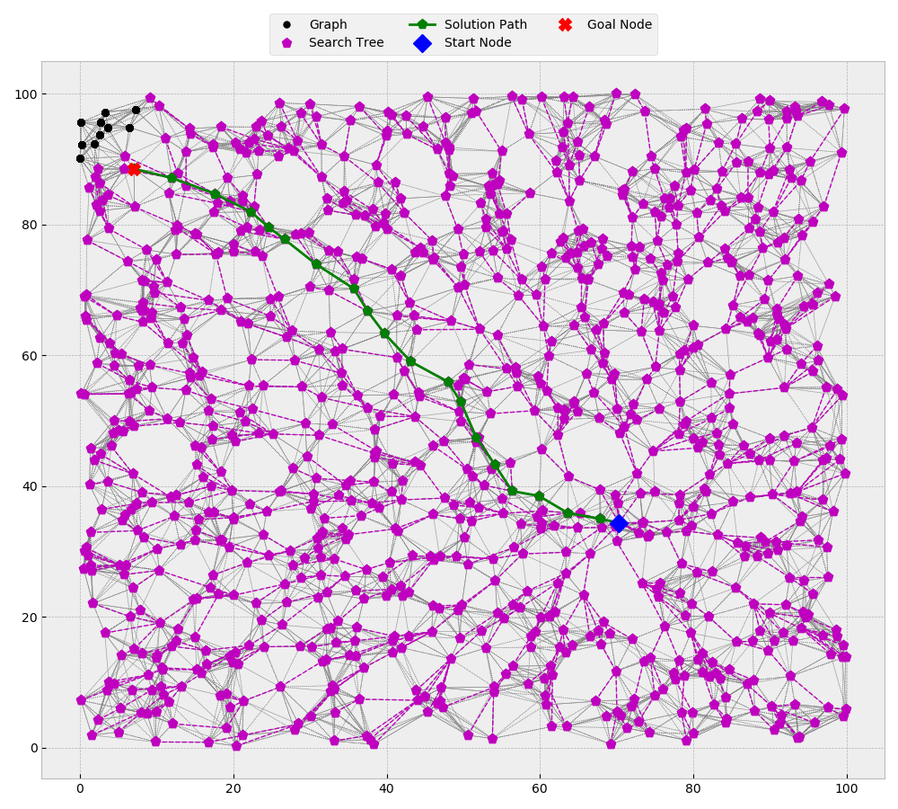

# dijkstra

## Overview
This is a basic graph based dijkstra search implementation in C++17.  
Dijkstra algorithm is just a special case of A-star algorithm with heuristic weight equal to 0.  
  
Run the [a-star](../a-star) algorithm with the `-w 0` parameter.  
Alternatively, you could use the [*zero_heuristic*](../a-star/src/search.h) functor as input to the 
[search_x](../a-star/src/search.h) functions (example use in [a_star.cpp](../a-star/src/a_star.cpp)).

Please see the [a-star](../a-star) project for more details on its use.

### Sample Run
```shell script
../a-star/cmake-build-release/a_star -s 38 -g 502 -n ./inputs/nodes_4.txt -e ./inputs/edges_with_costs_4.txt -p ./outputs/path_output_4.txt -t ./outputs/search_output_4.txt -v -w 0
start_id: 38, goal_id: 502, weight: 0, verbose: 1
node_fp: ./inputs/nodes_4.txt
edge_fp: ./inputs/edges_with_costs_4.txt
path_fp: ./outputs/path_output_4.txt
search_fp: ./outputs/search_output_4.txt

Successfully opened the nodes file: ./inputs/nodes_4.txt
The nodes files has 1000 nodes.
1000 nodes were added to the graph.

Successfully opened the edges file: ./inputs/edges_with_costs_4.txt
The edges file has 20000 edges.
11578 unique edges were added to the graph.

The search was successful. It took 264 microseconds.
Start Node: node_id: 38, x: 70.3233, y: 34.3574, p_node_id: 0, status: closed, g_cost: 0, h_cost: 0, f_cost: 0
Goal Node: node_id: 502, x: 7.03754, y: 88.4659, p_node_id: 473, status: closed, g_cost: 87.509, h_cost: 0, f_cost: 87.509

Successfully opened the path file: ./outputs/path_output_4.txt
Successfully wrote path file: "./outputs/path_output_4.txt".

Successfully opened the graph file: ./outputs/search_output_4.txt
Successfully wrote graph file: "./outputs/search_output_4.txt".
```
This search was then visualized using [search_viz.py](./support_files/search_viz.py)  


See the [SAMPLE_RUNS.md](./SAMPLE_RUNS.md) file to see graph output of Dijkstra search on input files available in
[inputs](./inputs). The output files of the search are saved in [outputs](./outputs).

