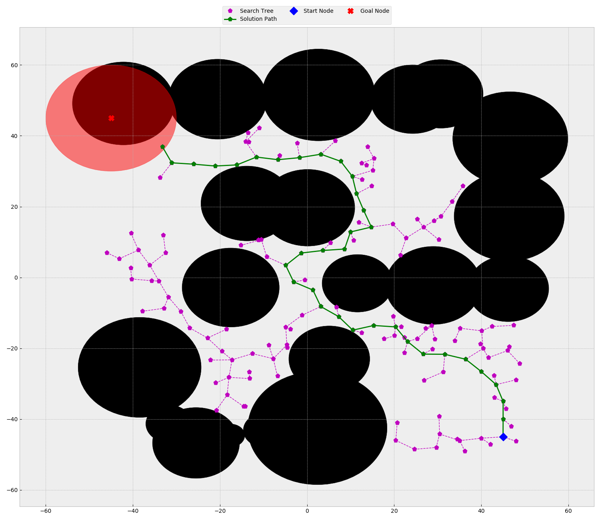

```shell script
./cmake-build-release/rrt_2d -s '(0,0)' -g '(-38,20,10)' -e 10 -o ./inputs/obstacles.txt -p ./outputs/path_output_1.txt -t ./outputs/search_output_1.txt -v
start: x: 0, y: 0 , goal: x: -38, y: 20 , r: 10 , bias: 0, epsilon: 10, verbose: 1, iter_lim: 100000000
obs_fp: ./inputs/obstacles.txt
path_fp: ./outputs/path_output_1.txt
search_fp: ./outputs/search_output_1.txt

Successfully opened the obstacle file: ./inputs/obstacles.txt
The obstacle file has 20 obstacles.
20 obstacles were added to obstacle vector.

The search was successful. It took 40 microseconds.
Start: x: 0, y: 0
Goal: x: -38, y: 20 , r: 10

Successfully opened the path file: ./outputs/path_output_1.txt
Successfully wrote path file: "./outputs/path_output_1.txt".

Successfully opened the graph file: ./outputs/search_output_1.txt
Successfully wrote graph file: "./outputs/search_output_1.txt".
```
This search was then visualized using [search_viz.py](./support_files/search_viz.py)  


```shell script
./cmake-build-release/rrt_2d -s '(27,30)' -g '(-48,20,10)' -e 5 -o ./inputs/obstacles.txt -p ./outputs/path_output_2.txt -t ./outputs/search_output_2.txt -v
start: x: 27, y: 30 , goal: x: -48, y: 20 , r: 10 , bias: 0, epsilon: 5, verbose: 1, iter_lim: 100000000
obs_fp: ./inputs/obstacles.txt
path_fp: ./outputs/path_output_2.txt
search_fp: ./outputs/search_output_2.txt

Successfully opened the obstacle file: ./inputs/obstacles.txt
The obstacle file has 20 obstacles.
20 obstacles were added to obstacle vector.

The search was successful. It took 83 microseconds.
Start: x: 27, y: 30
Goal: x: -48, y: 20 , r: 10

Successfully opened the path file: ./outputs/path_output_2.txt
Successfully wrote path file: "./outputs/path_output_2.txt".

Successfully opened the graph file: ./outputs/search_output_2.txt
Successfully wrote graph file: "./outputs/search_output_2.txt".
```
This search was then visualized using [search_viz.py](./support_files/search_viz.py)  


```shell script
./cmake-build-release/rrt_2d -s '(45,-45)' -g '(-45,45,15)' -e 5 -o ./inputs/obstacles.txt -p ./outputs/path_output_3.txt -t ./outputs/search_output_3.txt -v
start: x: 45, y: -45 , goal: x: -45, y: 45 , r: 15 , bias: 0, epsilon: 5, verbose: 1, iter_lim: 100000000
obs_fp: ./inputs/obstacles.txt
path_fp: ./outputs/path_output_3.txt
search_fp: ./outputs/search_output_3.txt

Successfully opened the obstacle file: ./inputs/obstacles.txt
The obstacle file has 20 obstacles.
20 obstacles were added to obstacle vector.

The search was successful. It took 203 microseconds.
Start: x: 45, y: -45
Goal: x: -45, y: 45 , r: 15

Successfully opened the path file: ./outputs/path_output_3.txt
Successfully wrote path file: "./outputs/path_output_3.txt".

Successfully opened the graph file: ./outputs/search_output_3.txt
Successfully wrote graph file: "./outputs/search_output_3.txt".
```
This search was then visualized using [search_viz.py](./support_files/search_viz.py)  


```shell script
./cmake-build-release/rrt_2d -s '(-16,10)' -g '(18,-45,5)' -e 2 -o ./inputs/obstacles.txt -p ./outputs/path_output_4.txt -t ./outputs/search_output_4.txt -v
start: x: -16, y: 10 , goal: x: 18, y: -45 , r: 5 , bias: 0, epsilon: 2, verbose: 1, iter_lim: 100000000
obs_fp: ./inputs/obstacles.txt
path_fp: ./outputs/path_output_4.txt
search_fp: ./outputs/search_output_4.txt

Successfully opened the obstacle file: ./inputs/obstacles.txt
The obstacle file has 20 obstacles.
20 obstacles were added to obstacle vector.

The search was successful. It took 301 microseconds.
Start: x: -16, y: 10
Goal: x: 18, y: -45 , r: 5

Successfully opened the path file: ./outputs/path_output_4.txt
Successfully wrote path file: "./outputs/path_output_4.txt".

Successfully opened the graph file: ./outputs/search_output_4.txt
Successfully wrote graph file: "./outputs/search_output_4.txt".
```
This search was then visualized using [search_viz.py](./support_files/search_viz.py)  


```shell script
./cmake-build-release/rrt_2d -s '(39,5)' -g '(38,-8,3)' -e 1 -o ./inputs/obstacles.txt -p ./outputs/path_output_5.txt -t ./outputs/search_output_5.txt -v
start: x: 39, y: 5 , goal: x: 38, y: -8 , r: 3 , bias: 0, epsilon: 1, verbose: 1, iter_lim: 100000000
obs_fp: ./inputs/obstacles.txt
path_fp: ./outputs/path_output_5.txt
search_fp: ./outputs/search_output_5.txt

Successfully opened the obstacle file: ./inputs/obstacles.txt
The obstacle file has 20 obstacles.
20 obstacles were added to obstacle vector.

The search was successful. It took 5548 microseconds.
Start: x: 39, y: 5
Goal: x: 38, y: -8 , r: 3

Successfully opened the path file: ./outputs/path_output_5.txt
Successfully wrote path file: "./outputs/path_output_5.txt".

Successfully opened the graph file: ./outputs/search_output_5.txt
Successfully wrote graph file: "./outputs/search_output_5.txt".
```
This search was then visualized using [search_viz.py](./support_files/search_viz.py)  
