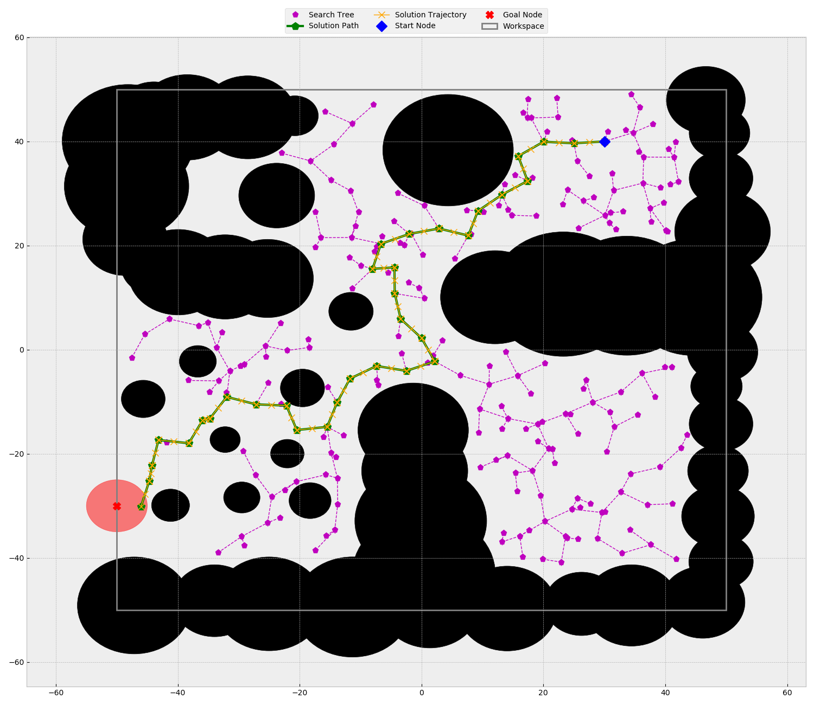

# rrt_adv

## Overview
This is an advanced graph based rapidly-exploring random tree (RRT) search implementation in C++17.  
The graph structure was implemented using Boost Graph Library. Nodes and Edges are user defined structures.
The graph was configured for bidirectional architecture.
The terminal arguments parsing is done using Boost Program Option Library.

### Motion Model Description
dx/dt = v * cos(th); x in [-50, 50]  
dy/dt = v * sin(th); y in [-50, 50]  
dth/dt = w; th in [0, 2pi]  
dv/dt = a; v in [-5, 5]  
dw/dt = g; w in [-pi/2, pi/2]  
a in [-2, 2]  
g in [-pi/2, pi/2]  

a and g are individually controllable.

### Motion Model Simplification
Because theta can be modified independently by applying the control input gamma, the motion model can be reduced to
simulate a holonomic motion model.  
For example, we can move from any point to another by doing the following:  
- Accelerate to an angular velocity, then maintain for some time, then decelerate till angular velocity is 0.
This is done in such a manner that the resulting orientation points towards the next point of traversal.  
- Accelerate to a linear velocity, then maintain for some time, then decelerate till linear velocity is 0. 
This is done in such a manner that the resulting position is the same as the next point of traversal.  

By using the above mentioned process, the motion of the robot will result in a trajectory where the robot always
turns on spot towards the next point of traversal and then moves towards it in a straight line.


### Code Description

See the [SAMPLE_RUNS.md](./SAMPLE_RUNS.md) file to see graph output of RRT search on environment defined by the 
obstacles file available in [inputs](./inputs). The output files of the search are saved in [outputs](./outputs).

There main search functions is defined in [search.h](src/search.h). This functions implement the RRT search.
```c++
std::pair<int, bool>
search(const Point2_1D &start, const GoalZone &goal, Graph &g,
        Workspace &w_space, const ObstacleVec &obs_vec, const RoboGeometry &robot,
        const std::function<bool(const Point2D&, const Point2D&, const CircleObstacle&)> &collision_func,
        const double eps = 1, const int iter_lim = 1e8, const int verbose = 0)
```

An example RRT search can be executed by compiling and running the [rrt.cpp](src/rrt.cpp) file. See the
[Run Instructions](#run-instructions) below for more details on building and running the project.

The code was written to allow a desired level of configurability. Run the code with -h/--help tag to know more.  
```
./cmake-build-release/rrt_adv -h
Allowed options:
  -h [ --help ]                               Print the help message
                                              
  -s [ --start ] arg (=x: 0, y: 0 , o: 0 )    Start node coordinate as (x, y, o)
  -g [ --goal ] arg (=x: 40, y: 40 , r: 1 )   Goal node coordinate as (x, y, r)
  -b [ --bias ] arg (=0)                      The goal bias. Probability in range [0, 1]
  -e [ --eps ] arg (=5)                       The maximum distance covered by a new trajectory during exploration.
  -i [ --iter_lim ] arg (=100000000)          The maximum number of exploration iterations allowed.
  -r [ --rand_seed ] arg (=-1)                The seed for the random number generator. -1 would mean 
                                              non-deterministically random.
  -v [ --verbose ] [=arg(=1)] (=0)            Verbosity. Choose between 0, 1, 2 and 3
  -o [ --obs_fp ] arg (=obstacle.txt)         Relative/absolute path to the obstacle file
  -m [ --robo_fp ] arg (=robot.txt)           Relative/absolute path to the robot file
  -p [ --path_fp ] arg (=path_output.txt)     Relative/absolute path to the Path output file
  -t [ --search_fp ] arg (=search_output.txt) Relative/absolute path to the Search output file
```

Also, the program can be compiled to use a collision detection function from a list of collision detection functions
defined in [search.h](src/search.h). Some examples of collision detection function are: 
*collision_check_1*, *collision_check_2*, *collision_check_3*.

The RRT algorithm computes the solution trajectory on a reduced dimensionality. This is done by assuming that the
motion of the robot always follows the simplified motion model.  
The path generated by the RRT algorithm is then post-processed using [post_process_path.cpp](src/post_process_path.cpp) 
file. Here the trajectory with the required dimensionality is computed based on the simplified motion model.  

Run the code with -h/--help tag to know more.
```
./cmake-build-release/post_process -h
Allowed options:
  -h [ --help ]                           Print the help message
                                          
  -v [ --verbose ] [=arg(=1)] (=0)        Verbosity. Choose between 0, 1, 2 and 3
  -i [ --ip_path ] arg (=path_output.txt) Relative/absolute path to the input path file
  -o [ --op_path ] arg (=traj_output.txt) Relative/absolute path to the input path file
```

### Run Instructions
**For Ubuntu:**  
**Option 1:** (Execute the build_script.sh and run_script.sh)
```shell script
# open this directory
cd <path to this directory>

# build the project
./build_script.sh

# run the a_star algorithm for some sample inputs
./run_script.sh
```

**Option 2:** (Build and run the project yourself)
```shell script
# open this directory
cd <path to this directory>

# view the CMakeLists.txt file of the sub-project
cat ./CMakeLists.txt

# make sure proper directories are included in the CMakeLists.txt file.
<use code editor of your preference to edit CMakeLists.txt>

# create a build directory
mkdir build

# open the build directory
cd build

# cmake the project in the build directory
cmake .. 

# make the cmake project
make -j4

# execute the generated executible file
./<executible file>
```

**For Windows:** I would recommend using an IDE that uses CMake for build process. Use the contents of the provided
CMakeLists_Windows.txt file in the CMakeLists.txt file of your project generated by the IDE.  
Example IDE: CLion by Jetbrains, Visual Studio etc.

### Sample Run
```shell script
+ ./cmake-build-release/rrt_adv -s '(30,40,270)' -g '(-50,-30,5)' -e 5 -o ./inputs/obstacles.txt -m ./inputs/robot.txt -p ./outputs/path_output_3.txt -t ./outputs/search_output_3.txt -v -r 20
start: x: 30, y: 40 , o: 4.71239 , goal: x: -50, y: -30 , r: 5 , bias: 0, seed: 20, eps: 5, verbose: 1, iter_lim: 100000000
obs_fp: ./inputs/obstacles.txt
robo_fp: ./inputs/robot.txt
path_fp: ./outputs/path_output_3.txt
search_fp: ./outputs/search_output_3.txt 

Successfully opened the obstacle file: ./inputs/obstacles.txt
The obstacle file has 51 obstacles.
51 obstacles were added to obstacle vector.

Successfully opened the robot geometry file: ./inputs/robot.txt
36 points were added to robot geometry.

The search was successful. It took 40809 microseconds.
Start: x: 30, y: 40 , o: 4.71239 
Goal: x: -50, y: -30 , r: 5 

Successfully opened the path file: ./outputs/path_output_3.txt
Successfully wrote path file: "./outputs/path_output_3.txt".

Successfully opened the graph file: ./outputs/search_output_3.txt
Successfully wrote graph file: "./outputs/search_output_3.txt".

+ ./cmake-build-release/post_process -i ./outputs/path_output_3.txt -o ./outputs/traj_output_3.txt -v
v:1, i: ./outputs/path_output_3.txt, o: ./outputs/traj_output_3.txt

Successfully opened the path file: ./outputs/path_output_3.txt
33 points were added to path vector.

Successfully opened the trajectory file: ./outputs/traj_output_3.txt
Successfully wrote trajectory file: "./outputs/traj_output_3.txt".
```
This search was then visualized using [search_viz.py](./support_files/search_viz.py)  


See the [SAMPLE_RUNS.md](./SAMPLE_RUNS.md) file to see graph output of RRT search on environment defined by the
obstacles file available in [inputs](./inputs). The output files of the search are saved in [outputs](./outputs).